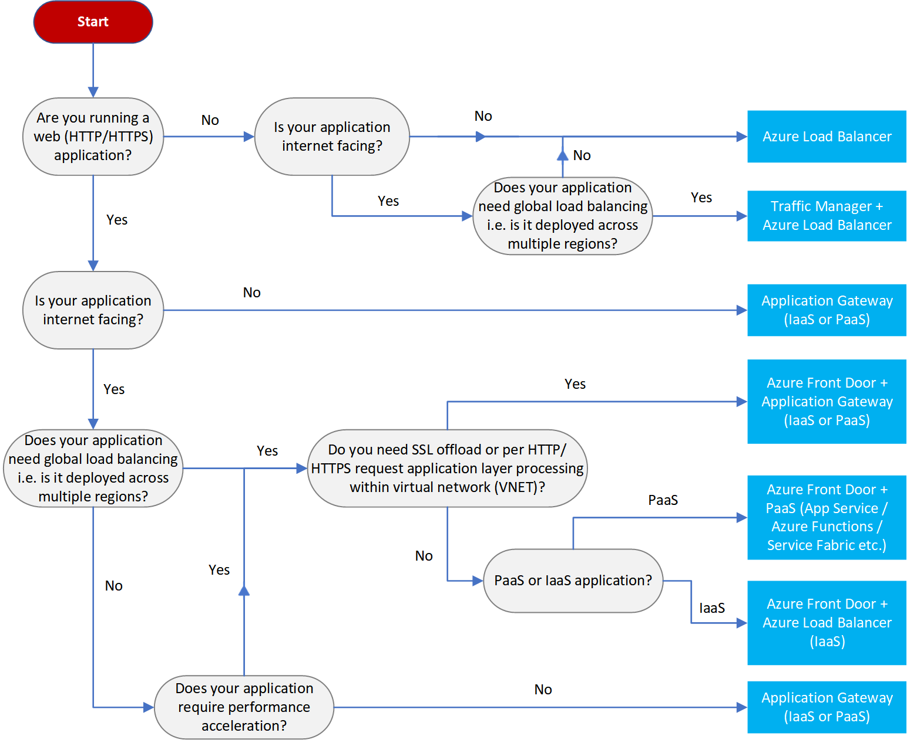

# Decision tree for load balancing in Azure

Azure offers a number of ways to host your application code. The term *compute* refers to the hosting model for the computing resources that your application runs on. The following flowchart will help you to choose a compute service for your application. The flowchart guides you through a set of key decision criteria to reach a recommendation.

**Treat this flowchart as a starting point.** Every application has unique requirements, so use the recommendation as a starting point. Then perform a more detailed evaluation, looking at aspects such as:

- Feature set
- [Service limits](/azure/azure-subscription-service-limits)
- [Cost](https://azure.microsoft.com/pricing/)
- [SLA](https://azure.microsoft.com/support/legal/sla/)
- [Regional availability](https://azure.microsoft.com/global-infrastructure/services/)
- IT/DevOps ecosystem and team skills

If your application consists of multiple workloads, evaluate each workload separately. A complete solution may incorporate two or more compute services.

For more information about your options for hosting containers in Azure, see [Azure Containers](https://azure.microsoft.com/overview/containers/).

## Flowchart

## Definitions

- **"Lift and shift"** is a strategy for migrating a workload to the cloud without redesigning the application or making code changes. Also called *rehosting*. For more information, see [Azure migration center](https://azure.microsoft.com/migration/).

- **Cloud optimized** is a strategy for migrating to the cloud by refactoring an application to take advantage of cloud-native features and capabilities.

## Next steps

For additional criteria to consider, see [Criteria for choosing an Azure compute service](./compute-comparison.md).
